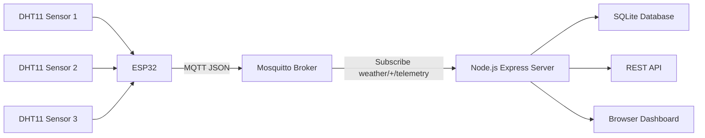

# ESP32 MQTT Weather Station - Final Exercise Report

## Project Repository

GitHub repository:

[https://github.com/sumeshadh95/finalweatherstation](https://github.com/sumeshadh95/finalweatherstation)

---

## 1. Project Overview

For my final IoT exercise, I created a small weather station using an ESP32 and three DHT11 temperature and humidity sensors.

The ESP32 reads the sensor values, calculates moving averages, and sends the data to my own Mosquitto MQTT broker running on a Debian virtual machine. The MQTT data is then received by a Node.js Express server. The server stores the measurements in an SQLite database, provides REST API endpoints, and displays the latest values in a browser dashboard.

The main data flow is:

```text
DHT11 sensors -> ESP32 -> Mosquitto MQTT broker -> Node.js server -> SQLite database / REST API / browser dashboard
```

---

## 2. Implemented Requirements

| Requirement | Status | Explanation |
|---|---:|---|
| ESP32 reads sensor data | Done | ESP32 reads 3 DHT11 sensors |
| Moving average | Done | Latest 6 readings are used for smoothing |
| MQTT data transfer | Done | ESP32 publishes JSON data to Mosquitto |
| Self-made server | Done | Node.js Express server |
| Browser access | Done | Dashboard available from browser |
| MQTT broker configured by myself | Done | Mosquitto installed and configured on Debian |
| Extra feature 1 | Done | SQLite database |
| Extra feature 2 | Done | REST API |

Because the project includes both a database and REST API, it goes beyond the minimum implementation.

---

## 3. System Architecture



The system has four main parts:

1. ESP32 reads the DHT11 sensors.
2. ESP32 publishes sensor data to Mosquitto using MQTT.
3. Node.js server subscribes to the MQTT topic and stores readings.
4. Browser dashboard and REST API show the stored/latest values.

---

## 4. Hardware Used

The hardware and software used in this project:

| Item | Purpose |
|---|---|
| ESP32 development board | Reads sensors and sends MQTT data |
| 3 x DHT11 sensors | Temperature and humidity measurements |
| Debian virtual machine | Runs Mosquitto and Node.js server |
| Mosquitto MQTT broker | Receives MQTT messages from ESP32 |
| Node.js Express server | Web server and MQTT subscriber |
| SQLite database | Stores measurement history |
| Web browser | Displays dashboard and API output |

---

## 5. Wiring

I used 3-pin DHT11 modules. Because these are sensor modules, I did not need an external pull-up resistor.

| Sensor | VCC | GND | DATA |
|---|---|---|---|
| DHT11 1 | ESP32 3V3 | ESP32 GND | GPIO 25 |
| DHT11 2 | ESP32 3V3 | ESP32 GND | GPIO 26 |
| DHT11 3 | ESP32 3V3 | ESP32 GND | GPIO 27 |

All sensors share the same ESP32 `3V3` and `GND`.

---

## 6. Mosquitto MQTT Broker Configuration

The MQTT broker was installed and configured on my Debian virtual machine.

The configuration file used was:

```text
/etc/mosquitto/conf.d/mosquitto.conf
```

For the final version, I disabled anonymous access and enabled username/password authentication.

```conf
listener 1883
allow_anonymous false
password_file /etc/mosquitto/passwd
```

The MQTT username and password were created with `mosquitto_passwd`.

Example commands:

```bash
sudo mosquitto_passwd -c /etc/mosquitto/passwd esp32user
sudo chown root:mosquitto /etc/mosquitto/passwd
sudo chmod 640 /etc/mosquitto/passwd
sudo systemctl restart mosquitto.service
systemctl status mosquitto.service
```

The ESP32 and Node.js server both use the same MQTT login:

```text
Username: esp32user
Password: esp32pass
```

### Screenshot: Secure Mosquitto Configuration and MQTT Test


---

## 7. MQTT Topic Design

The ESP32 publishes data to this topic:

```text
weather/esp32-sumesh-01/telemetry
```

The Node.js server subscribes to:

```text
weather/+/telemetry
```

This topic structure is useful because the server can support more ESP32 devices in the future.

For example:

```text
weather/esp32-sumesh-01/telemetry
weather/esp32-sumesh-02/telemetry
weather/esp32-sumesh-03/telemetry
```

The `+` wildcard allows the server to receive messages from different ESP32 devices.

---

## 8. ESP32 Program

The ESP32 code uses these libraries:

```cpp
#include <WiFi.h>
#include <PubSubClient.h>
#include <DHT.h>
```

Important settings from the ESP32 code:

```cpp
const char* WIFI_SSID = "Xamklab";
const char* MQTT_HOST = "172.20.49.17";
const int MQTT_PORT = 1883;

const char* MQTT_USER = "esp32user";
const char* MQTT_PASSWORD = "esp32pass";

const char* DEVICE_ID = "esp32-sumesh-01";
const char* MQTT_TOPIC = "weather/esp32-sumesh-01/telemetry";

#define DHTTYPE DHT11
#define SENSOR_COUNT 3
#define WINDOW_SIZE 6

const int DHT_PINS[SENSOR_COUNT] = {25, 26, 27};
```

The ESP32 reads all three sensors every 10 seconds.

The moving average uses the latest 6 readings:

```text
6 readings x 10 seconds = about 1 minute moving average
```

This makes the displayed values smoother and reduces the effect of small sensor errors.

---

## 9. Important ESP32 MQTT Fix

At first, the ESP32 connected to Mosquitto, but the dashboard did not receive the actual sensor JSON data.

The reason was that the JSON payload from three sensors was too large for the default `PubSubClient` MQTT buffer.

The fix was to increase the MQTT buffer size:

```cpp
mqttClient.setBufferSize(1024);
```

After adding this, the ESP32 MQTT messages were received correctly by Mosquitto and the Node.js server.

---

## 10. Moving Average

The moving average is calculated in the ESP32 code.

The purpose of the moving average is to smooth the sensor values. Instead of only sending one raw reading, the ESP32 calculates the average of the latest readings.

Example:

```text
Readings:
23.3, 23.4, 23.5, 23.4, 23.6, 23.5

Moving average:
(23.3 + 23.4 + 23.5 + 23.4 + 23.6 + 23.5) / 6
```

This gives a more stable temperature value.

---

## 11. MQTT JSON Payload

The ESP32 sends data as JSON.

Example payload:

```json
{
  "deviceId": "esp32-sumesh-01",
  "rssi": -45,
  "sensors": [
    {
      "id": "dht11-1",
      "temperature": 23.4,
      "humidity": 5.0,
      "avgTemperature": 23.35,
      "avgHumidity": 5.0
    },
    {
      "id": "dht11-2",
      "temperature": 23.6,
      "humidity": 29.0,
      "avgTemperature": 23.6,
      "avgHumidity": 29.0
    },
    {
      "id": "dht11-3",
      "temperature": 23.5,
      "humidity": 26.0,
      "avgTemperature": 23.5,
      "avgHumidity": 26.0
    }
  ]
}
```

### Screenshot: MQTT Subscriber Receiving ESP32 JSON


---

## 12. Node.js Express Server

The server is built with:

- Node.js
- Express
- MQTT library
- SQLite database using `better-sqlite3`

The server connects to Mosquitto and subscribes to:

```text
weather/+/telemetry
```

Command used to start the server:

```bash
cd ~/final-weather-station/server
MQTT_URL=mqtt://localhost:1883 MQTT_USER=esp32user MQTT_PASSWORD=esp32pass MQTT_TOPIC='weather/+/telemetry' npm start
```

The server listens on:

```text
http://0.0.0.0:3000
```

From Windows, I accessed it using the Debian VM IP:

```text
http://172.20.49.17:3000
```

### Screenshot: Node.js Server Storing ESP32 Readings


---

## 13. SQLite Database

The Node.js server stores incoming MQTT readings in an SQLite database.

The database stores:

| Field | Meaning |
|---|---|
| `id` | Reading ID |
| `device_id` | ESP32 device name |
| `sensor_id` | Sensor name |
| `temperature` | Raw temperature |
| `humidity` | Raw humidity |
| `avg_temperature` | Moving average temperature |
| `avg_humidity` | Moving average humidity |
| `rssi` | Wi-Fi signal strength |
| `created_at` | Time when the reading was stored |

Example command used to check the database:

```bash
sqlite3 ~/final-weather-station/server/weather.db 'select * from readings limit 10;'
```

This database is one of the extra features of the project.

### Screenshot: SQLite Database and Mosquitto Log


---

## 14. REST API

The server provides REST API endpoints. This is the second extra feature.

| Endpoint | Purpose |
|---|---|
| `/api/readings/latest` | Latest readings for all sensors |
| `/api/clients/esp32-sumesh-01/data.json` | History data for the ESP32 client |
| `/api/clients/esp32-sumesh-01/status` | Device status |
| `/api/clients/esp32-sumesh-01/sensors/dht11-1/latest` | Latest reading from one sensor |

Example URLs:

```text
http://172.20.49.17:3000/api/readings/latest
http://172.20.49.17:3000/api/clients/esp32-sumesh-01/data.json
http://172.20.49.17:3000/api/clients/esp32-sumesh-01/status
```

### Screenshot: REST API Latest Readings


### Screenshot: REST API Device Status


---

## 15. Browser Dashboard

The dashboard is available from a browser:

```text
http://172.20.49.17:3000
```

The dashboard shows:

- System status
- Last update time
- Number of active sensors
- Number of devices
- Average temperature
- Average humidity
- One card for each DHT11 sensor
- REST API links
- Latest API JSON data

The frontend updates automatically by requesting:

```text
/api/readings/latest
```

The dashboard makes it easy to see the current sensor values without using the terminal.

### Screenshot: Browser Dashboard With Live Sensor Data


---

## 16. Testing Process

I tested the system step by step.

### 16.1 Mosquitto Authentication Test

First, I tested MQTT with username/password authentication.

Subscriber command:

```bash
mosquitto_sub -h localhost -p 1883 -u esp32user -P esp32pass -t 'weather/+/telemetry' -v
```

Publisher command:

```bash
mosquitto_pub -h localhost -p 1883 -u esp32user -P esp32pass -t weather/test/telemetry -m "hello secure mqtt"
```

This confirmed that anonymous MQTT access was disabled and authenticated MQTT worked.

### 16.2 ESP32 MQTT Test

Then I uploaded the ESP32 code and opened the Arduino Serial Monitor.

The Serial Monitor showed:

```text
WiFi connected
MQTT connected
Published to weather/esp32-sumesh-01/telemetry
```

The MQTT subscriber also received JSON messages from the ESP32.

### 16.3 Server Test

After that, I started the Node.js server and checked the terminal output.

The server showed that it was connected to MQTT and storing readings:

```text
Connected to MQTT broker mqtt://localhost:1883
Subscribed to weather/+/telemetry
Stored 3 reading(s) from esp32-sumesh-01
```

### 16.4 Browser and API Test

Finally, I opened the browser dashboard and API endpoints.

I checked:

```text
http://172.20.49.17:3000
http://172.20.49.17:3000/api/readings/latest
http://172.20.49.17:3000/api/clients/esp32-sumesh-01/status
```

The dashboard and API both showed sensor data.

---

## 17. Problems Solved

During the project, I had a few problems and fixed them.

### Problem 1: Mosquitto refused to start

At one point, Mosquitto failed because there were configuration or permission issues. I fixed it by keeping the correct config file and setting the password file permissions correctly.

Working permission setup:

```bash
sudo chown root:mosquitto /etc/mosquitto/passwd
sudo chmod 640 /etc/mosquitto/passwd
```

### Problem 2: MQTT authentication failed

I got this error:

```text
Connection Refused: not authorised
```

I fixed it by resetting the MQTT user/password with `mosquitto_passwd`.

### Problem 3: Dashboard was empty

The dashboard opened, but it first showed no ESP32 data.

The ESP32 was connected to Mosquitto, but the JSON payload was too large for the default MQTT buffer.

The fix was:

```cpp
mqttClient.setBufferSize(1024);
```

After this, ESP32 messages arrived correctly.

---

## 18. Final Result

The final system works successfully.

It can:

- Read temperature and humidity from three DHT11 sensors
- Calculate moving averages on the ESP32
- Publish JSON data over MQTT
- Use secure Mosquitto username/password authentication
- Receive MQTT data in a Node.js server
- Store readings in SQLite
- Provide REST API endpoints
- Show live sensor values in a browser dashboard

---

## 19. Why This Can Reach Full Points

The minimum implementation requires:

- ESP32 sensor reading
- Moving average
- MQTT transfer
- Self-made server
- Browser access

My project includes all of these.

It also includes two extra features:

1. SQLite database
2. REST API

Because of these two extra features, the project is more complete than the minimum version.

---

## 20. Conclusion

This project meets the main requirements of the final exercise. The ESP32 reads real sensor data from three DHT11 sensors and sends the data through MQTT to my own Debian server.

The server is accessible from a browser and displays the sensor values clearly. The SQLite database stores measurement history, and the REST API allows the measurements to be fetched by other programs or pages.

This made the project feel like a complete small IoT system instead of only a basic sensor test.

---

## 21. Use of Generative AI

I used generative AI as a helper while doing this project. It helped write the report and also helped me with some troubleshooting guides.
